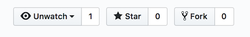
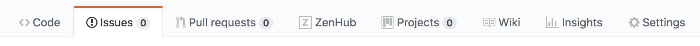
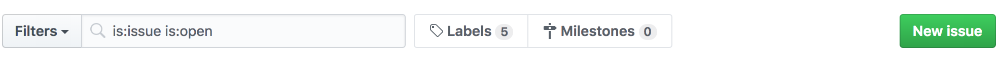
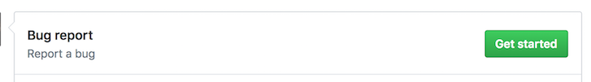
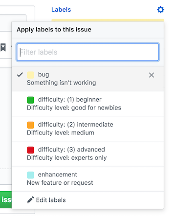
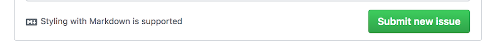

# SDJS Speaker Pipeline

[](#how-to-contribute) [](https://circleci.com/gh/sandiegojs/sdjs-speaker-pipeline) [](https://greenkeeper.io/)

## How to Contribute: 

**Working on your first Pull Request?** You can learn how from this _free_ series [How to Contribute to an Open Source Project on GitHub](https://egghead.io/series/how-to-contribute-to-an-open-source-project-on-github)

### Getting Started

1. Fork the project

2. Clone your fork

3. Make sure you are in the right directory: `cd sdjs-speaker-pipeline`
4. Add an `upstream` remote for keeping your local repository up-to-date:
   > `git remote add upstream https://github.com/sandiegojs/sdjs-speaker-pipeline.git`
5. Create a `.env` file in the main directory and replace variables as needed. At a minimum you will need the following to be set:

```sh
ADMIN_USERNAME=admin
ADMIN_EMAIL=your@email.com	
ADMIN_PASSWORD=test	
ADMIN_PHONE=6193331234	
NODE_ENV=development	
ADMIN_SPEAKER_EMAIL_TEMPLATE=XXXXXXXX	
SENDGRID_API_KEY=XXXXXXX	
```

6. Run `npm install` to install the project dependencies
7. Run `npm run dev` to start your dev environment. This will automatically watch for changes to certain files and restart the server for you automatically.

## Running the project's tests

Make sure you have all the dependencies installed (`npm install`), then from the command line you can run the tests using: `npm run test`

If you wish to run the tests manually and see the Cypress user interface you can run the server in development mode and then open the test interface. This can be helpful if you are writing new tests and you wish to run only some of the tests.

Start the server: `npm run dev`

Start the test interface: `npm run cy:open`

### Reporting Bugs

1. Navigate to the "issues" tab, or [click here](https://github.com/sandiegojs/sdjs-speaker-pipeline/issues)

2. Click on the "New issue" button

3. Click on the "Get started" button to open a new bug report

  - Create a title (keep it short and descriptive)
  - Fill in the template with specific information about the bug
4. Click on the gear icon next to "Labels" and select the difficulty level required to fix the bug

5. Scroll to the bottom of the page and click on the "Submit new issue" button



### Creating a new PR

1. Make sure you are on the `master` branch, and you have pulled the latest changes

   > `git checkout master && git pull upstream master`

2. Install any new dependencies: `npm install`

3. Create a new branch off of the `master` branch

   > `git checkout -b [NEW BRANCH NAME]`

   > **Branch naming conventions:**  
   > `fix/[BRANCH]` for bug fixes  
   > `feature/[BRANCH]` for new features  
   > `dev/[BRANCH]` for non-user-facing changes  
   >  
   > The `[BRANCH]` portion should be kebab case. For example, if you want to update the README.md file, your branch could be called `dev/update-readme`

4. Make changes and commit them. `git add . && git commit -m "[YOUR COMMIT MESSAGE]"`

   > The subject of a commit message (the first line) should be 72 characters or less. If you need more room for a longer explanation of your changes, you can add a blank line below the subject and write a commit body. The commit message should be in present-imperative tense ("Update README.md" rather than "Updates" or "Updated").

5. Push your branch to your fork: `git push -u origin [BRANCH NAME]`

6. Open a new PR against the `master` branch from your fork using the GitHub user interface
